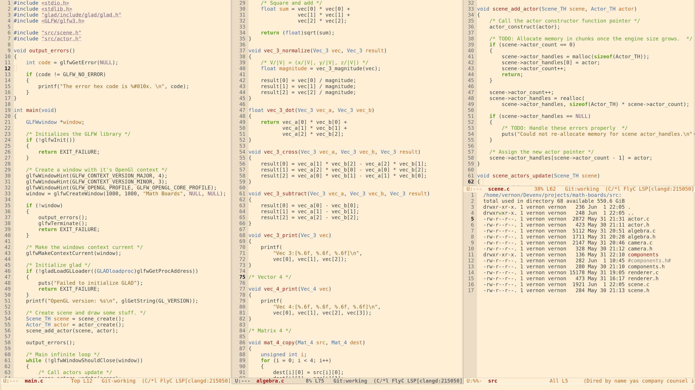

# Tango Now

The Emacs Tango theme with a few improvements. The original theme's colors were
based on the Tango desktop project, and this version stays true to that.

## Dark Version:

## Light Version:

